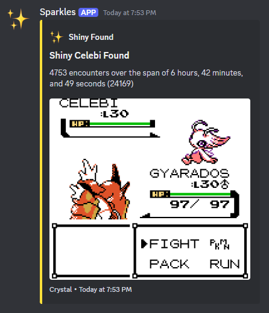

#   
# Celebi Hunter
A python program for mGBA that soft resets until it finds a shiny Celebi  

If you've seen my [other project](https://github.com/wishtag/frame-hunter) then this may seem familiar, and you would be correct. This is just a modified version of that with the specific intention of searching for Celebi.  

You may be asking "what's the point of this? You can't transfer Pokémon up from the Gen 2 games unless it's on the 3DS virtual console, and this is for the GBC version." and you'd be right. But if you're here, then you probably aren't opposed to breaking a few rules. Jump [here](https://github.com/wishtag/celebi-hunter#preparing-your-game-and-transferring-up) to see how to activate Celebi in your game, and how to transfer it up once you've got it.  
# Features
## Encountering
The way this works is the program soft resets the game, and then blindly sends inputs until the battle UI appears on screen. These blind inputs are just to mash through text and the title screen. Once the battle UI appears on screen, the program checks if the Celebi is shiny. If it's not shiny, the program restarts the process. This program also utilizes mGBA's speed up feature to encounter even more Celebi in less the time.  
## Logging
Tracks and saves the total encounters and elapsed time to `resets.json`.  
## Shiny Detection
The shiny detection is pretty simple, by choosing a color from the non-shiny variant that doesn't appear on the shiny variant, the program can tell if a Celebi is shiny. The program simply checks if a specific pixel is a certain color, if it is that color, then it's not shiny. But if it isn't that color, then you found a shiny!  
## Discord Notifying
Through the use of a discord webhook, the program will notify you when it finds a shiny.  
#   
# Showcase
https://github.com/user-attachments/assets/d2dd9b7d-26f6-47f8-9000-e23c4b10dcc6  
# Setup
Most of the setup is very easy, the hardest part is setting up the bounding boxes and stuff  
## Getting Positions
If you are on a 1080p display and position your window the same way shown in the showcase video then you should be able to skip everything under this section and just use the default values.
### Game Screen
**Step 1.** Take a screenshot of your whole screen.  
**Step 2.** Open the screenshot in an image editing software, I use [paint.net](https://www.getpaint.net/).  
**Step 3.** Determine how many pixels each side of the actualy game window is away from 0. For example: the left side of my game is 961 pixels from the left of the screen and the right side is 1919 from the left of the screen. The top of my game is 135 pixels away from the top of my screen and the bottom of my game is 997 pixels from the top of my screen. (I hope that all made sense)  
**Step 4.** Take the 4 numbers you got and enter them into `"game_screen": []` which is under `"bounding_boxes"` in `settings.json`. For reference this is what mine looks like: `"game_screen": [961, 135, 1919, 997]`  
### Encounter
**Step 1.** Encounter Celebi.  
**Step 2.** Take a screenshot of your whole screen, and then once again open it in an image editing software.  
**Step 3.** Pick one of the green pixels from the Celebi sprite.  
**Step 4.** Determine how far the pixel is from the left side and top of the screen. For example: the pixel I chose is 1670 pixels from the left of the screen and 420 pixels from the top of the screen.  
**Step 5.** Take those 2 numbers you got and enter them into `"encounter": []` which is under `"bounding_boxes"` in `settings.json`. For reference this is what mine looks like: `"encounter": [1670, 420]`  
You shouldn't have to do these next 2 steps and should be able to just leave them as the default, but if your display colors are different for some reason, then you'll want to do this.  
**Step 6.** Go back to the image editing software and get the RGB values of the pixel you chose.  
**Step 7.** Take those 3 numbers you got and enter them into the other `"encounter": []` which is under `"colors"` in `settings.json`. For reference this is what mine looks like: `"encounter": [82, 255, 0]`  
### HP
**Step 1.** You can reuse the screenshot from the last part, otherwise, encounter the Pokémon and wait for all the UI to show up, then screenshot your whole screen.  
**Step 2.** Open in image editing software, you get it by this point.  
**Step 3.** Pick a pixel on the text that says HP for Celebi's health bar. We do this because when the Pokémon is first encountered, its colors are in grayscale. By the time Celebi's health bar appears, the Pokémon is no longer in grayscale.  
**Step 4.** Repeat steps 4-7 from the last part except enter the values into `"hp": []` instead of `"encounter": []`.  
## Settings
The names for each setting is pretty self explanatory so I won't address each one, maybe that's just me being lazy but I have faith that you can figure it out.  
# Usage
## `main.py`
First, position yourself in front of the Ilex Forest Shrine and save your game. You are also going to want a Pokémon in the front of your party that has a non-damaging move as its first move. This is because sometimes the program misses what it is looking for in the screenshot it takes and can end up sending unwanted inputs. Doing it this way, we ensure that if any inputs are accidently sent, that the attack it ends up using doesn't KO the Celebi. After you have done that then you can run this program. When this program starts there will be a 3 second countdown before it starts sending inputs. In that 3 seconds, make sure you've focused on the game so that the inputs will connect. And that's pretty much all there is to it, now you just watch.  
# Preparing Your Game and Transferring Up
## Preparing
To enable the Celebi event in the GBC version of Crystal, you'll need to edit your save file. Open your save file in [PKHeX](https://projectpokemon.org/home/files/file/1-pkhex/). Navigate to the `SAV` tab and then click the button that says `Event Flags`. From here, check the boxes corresponding to the event flags `Received GS Ball` and `GS Ball can be inserted into Ilex Forest Shrine`. Save the changes and then click the `Items` button. Go to the `Key Items` tab and select one of the slots labelled `(None)`. Change it so that instead of `(None)` it is `GS Ball` and then change the count from `0` to `1`. Save the changes and then export your save. Now you should be able to encounter Celebi.  
## Transferring
If you are wanting to transfer this Celebi up to Pokémon Home, then you are going to need a modded 3DS. First, use [Checkpoint](https://github.com/BernardoGiordano/Checkpoint) to backup the save of a Gen 7 game on the 3DS. Power off the 3DS and remove the SD card so you can connect it to your computer. Open 2 instances of PKHeX, one with your Crystal save open, and the other with your Gen 7 save open. Drag the Celebi from your Crystal save to your Gen 7 save, this should place the Celebi in your Gen 7 game's box. Export your Gen 7 save and replace the Checkpoint backup with the one we just exported. Put the SD card back into the 3DS and boot into CFW. Open Checkpoint again and load the save. Now if you open your Gen 7 game, you should have the Celebi. From here you can transfer it to Pokémon Bank and then to Pokémon Home. Pokémon Bank and Pokémon Home should both recognize this Celebi as originating from the 3DS virtual console version of Pokémon Crystal. You shouldn't get banned doing this, but if you do, **I take no responsibility.**  
